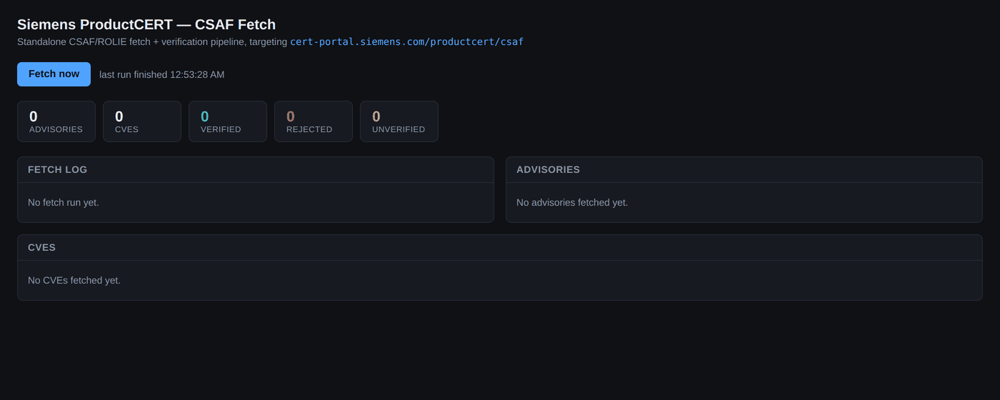
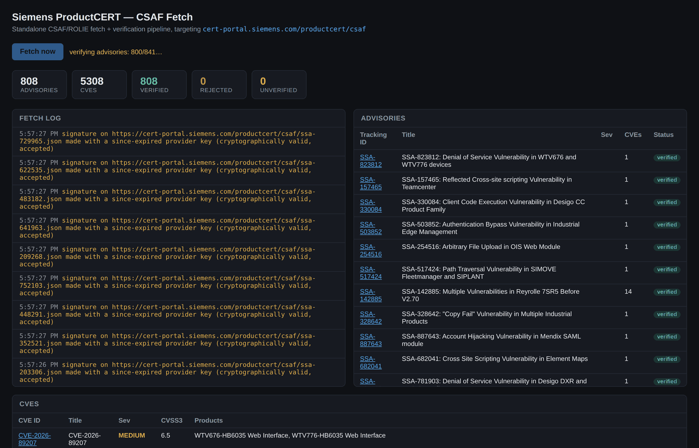
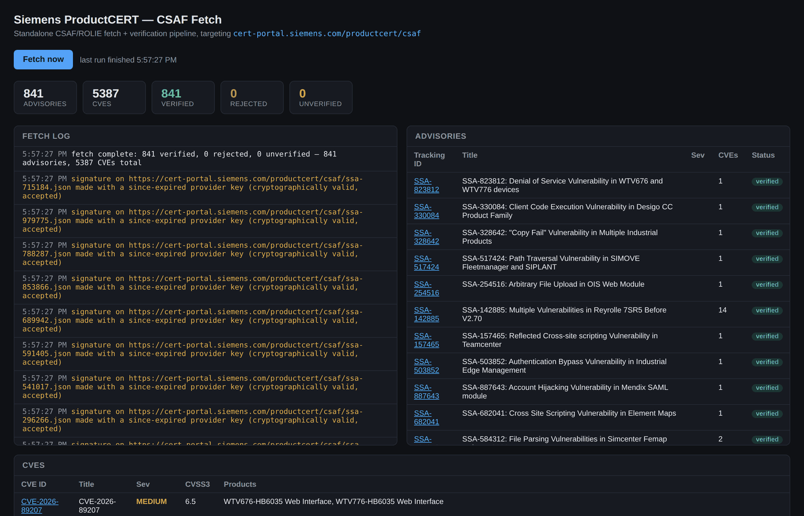

# Siemens ProductCERT CSAF Fetch

[](LICENSE)

A standalone CSAF/ROLIE fetch + verification pipeline, pointed at a single
feed: **Siemens ProductCERT**
(`https://cert-portal.siemens.com/productcert/csaf/provider-metadata.json`).

It exists to demonstrate, in isolation, the fix for Siemens rate-limiting a
full fetch of its CSAF feed (~800+ advisories). The fix has two parts:

1. **Signature-preferred verification** (`verify.go`) — an OpenPGP detached
   signature proves both integrity and authenticity, which is strictly
   stronger than the accompanying SHA-256/512 hash sidecar. So when a
   signature is advertised and verifies, the redundant hash fetch is skipped
   entirely — halving the number of requests per advisory (document + hash +
   signature → document + signature).
2. **Bounded worker pool** (`rolie.go`, `rolieAdvisoryWorkers = 8`) —
   concurrency is capped rather than scaled up, since more parallel requests
   just provoke provider rate-limiting without going faster.

Tampering (a wrong hash/signature) is still always rejected before parsing;
an *unreachable* sidecar (rate-limited, transient error) is stored as
`unverified` rather than discarding a legitimate advisory.

This is **read-only and stateless**: it fetches, verifies, and parses
advisories into memory for inspection. There is no database — restarting the
container drops everything. It does not write anything back to
`cert-portal.siemens.com`.

## Screenshots

The bundled frontend (`web/index.html`) is a single static page with no
build step, served by the same Go binary as the API. It polls
`/api/status`, `/api/log`, `/api/advisories`, and `/api/cves` every 1.2s
while a fetch is running.

**Idle**, before the first fetch:



**Running**, mid-fetch against the live Siemens feed — the log streams
per-advisory signature outcomes as the bounded worker pool processes them,
while the stat tiles and tables update incrementally:



**Complete** — a full run against `cert-portal.siemens.com`: 841 advisories,
5,387 CVEs, all 841 verified via OpenPGP signature, zero rejected, zero
unverified:



## Scope

This repository is a **deliberately narrow extraction**, not a general-purpose
CSAF client. It exists to isolate and demonstrate one fix in a reviewable,
runnable form — everything in it is scoped to that goal:

- **One feed, hardcoded.** The Siemens ProductCERT provider-metadata URL is a
  `const` in `main.go`. There is no config for adding other providers, no
  multi-tenant fetch, no scheduling — a fetch only ever happens when
  `POST /api/fetch` is called (manually, via the UI button, or by a script).
- **No persistence.** `store.go` is a mutex-guarded in-memory struct. Advisory
  and CVE data, and the fetch log, live only for the process lifetime; there
  is no database, no disk cache, no dedup across container restarts. A restart
  means the next fetch starts from scratch (a full ~800-advisory run, not
  incremental).
- **No write path to the provider.** Every request against
  `cert-portal.siemens.com` is a `GET`. The pipeline never authenticates,
  never uploads, never mutates anything upstream.
- **No auth, no multi-user state.** The HTTP API and UI are unauthenticated by
  design — this is meant to run locally or in a throwaway container for
  inspection, not to be exposed as a multi-tenant service.
- **Defense-in-depth included, but sized for this one path.** `safehttp.go`
  blocks SSRF via private/loopback/link-local dial targets and blocks a
  https→http redirect downgrade; `guard.go` caps every response size to what
  the Siemens feed's real documents look like (`maxAdvisoryBytes = 32 MiB`,
  etc.) and recovers panics per-worker so one malformed document can't take
  down a run. These guards are real and load-bearing, but their limits are
  tuned to a single known feed, not a hardened multi-provider ingestion
  service.
- **Parsing is intentionally partial.** `parse.go` extracts what the frontend
  needs (tracking ID, title, severity, CVEs, products, references) from CSAF
  2.0 JSON — it is not a full CSAF schema validator or a complete
  ingestion/normalization pipeline for a downstream vulnerability database.

In short: this is the smallest correct, runnable slice of a larger CSAF
ingestion pipeline that reproduces and fixes one specific problem (Siemens
ProductCERT rate-limiting a full feed fetch), stripped of everything
(persistence, multi-provider config, auth, scheduling) that isn't needed to
demonstrate that fix.

## Components

| File | Purpose |
|---|---|
| `safehttp.go` | SSRF-safe HTTP client (blocks private/loopback/link-local dial targets, blocks https→http redirect downgrade) |
| `guard.go` | Size-capped reads, panic recovery per worker/run |
| `verify.go` | OpenPGP signature + hash verification, tampered-vs-unavailable policy, the rate-limiting fix |
| `parse.go` | Pure CSAF JSON → CVE/Advisory parsing |
| `rolie.go` | Provider-metadata + ROLIE feed walk, bounded worker pool, conditional-GET incremental fetch |


## Run

```bash
docker compose up --build
```

Then open <http://localhost:8080> and click **Fetch now**. A full run
(~800 advisories, ~5,000 CVEs) takes a few seconds. A second click re-fetches
incrementally — unchanged advisories are skipped via the ROLIE feed's
conditional GET (`ETag`/`Last-Modified`) and per-entry `updated` timestamps.

Or run it directly:

```bash
go run .
```

## API

- `POST /api/fetch` — trigger a fetch; `409` if one is already running
- `GET /api/status` — running state, live progress, verified/rejected/unverified counters
- `GET /api/log` — fetch trail (newest first)
- `GET /api/advisories` — parsed advisories
- `GET /api/cves` — parsed CVEs

## License

Licensed under the MIT License. See [LICENSE](LICENSE).
